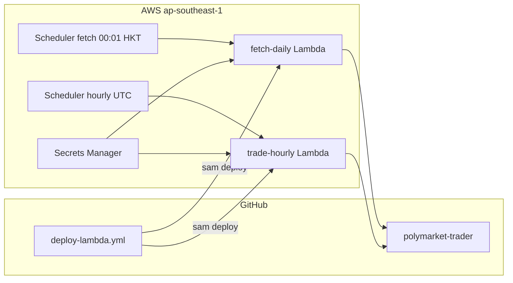

# Polymarket Weather Trading Bot

Periodic Python bot for Polymarket "highest temperature" daily weather markets.

## Features

- **Daily fetch** (`fetch-daily`): discovers today's highest-temp events via Gamma API, enriches with city timezone (API Ninjas) and local noon UTC window.
- **Hourly trade** (`trade-hourly`): trades events when city local time is within the configured trading window (default 12:00–14:00). After position checks, refreshes each event's markets from the Gamma API and CLOB buy prices before selection and order placement.
- **Two strategies** (select via `STRATEGY` env or `--strategy`):
  - `highest_yes` — buy the market with highest live book price if below `YES_PRICE_MAX` (default 0.60).
  - `forecast_match` — fetch forecast max temp (Wunderground resolution source or Open-Meteo fallback), buy matching bucket.
- **Trade logging**: step-by-step JSON logs in `logs/trades/` and `logs/app.log`.
- **Dry-run default**: no real orders until `DRY_RUN=false` or `--live`.

## Setup

Requires **Python 3.9.10+** (3.12+ recommended). Live trading needs `py-clob-client-v2` (included in `requirements.txt`).

```bash
cd polymarket-trader
# Use Python 3.12+ if your system python is older than 3.9.10 (e.g. macOS 3.9.6)
python3.12 -m venv .venv   # or: /opt/homebrew/bin/python3.12 -m venv ../.venv
source .venv/bin/activate
pip install -r requirements.txt
cp .env.example .env
# Edit .env with API_NINJAS_KEY and wallet credentials for live trading
```

## Usage

```bash
# Fetch today's events (run once daily)
python -m src.main fetch-daily

# Fetch events for a specific date
python -m src.main fetch-daily --date 2026-06-14

# Hourly trade (dry-run by default, uses today's events file)
python -m src.main trade-hourly
python -m src.main trade-hourly --date 2026-06-14
python -m src.main trade-hourly --strategy forecast_match
python -m src.main trade-hourly --strategy highest_yes --live
python -m src.main trade-hourly --date 2026-06-19 --live

# Manual run outside the noon window (trades every city for the date)
python -m src.main trade-hourly --date 2026-06-19 --all-cities --live

# Run built-in scheduler (daily fetch + hourly trade)
python -m src.main run-scheduler
```

### `trade-hourly` commands explained

| Command | Date | Strategy | Real orders? |
|---------|------|----------|--------------|
| `trade-hourly` | Today (or `EVENT_DATE` env) | `STRATEGY` env (default `highest_yes`) | No — dry-run |
| `trade-hourly --date 2026-06-14` | June 14 events file | `STRATEGY` env | No — dry-run |
| `trade-hourly --strategy forecast_match` | Today | `forecast_match` | No — dry-run |
| `trade-hourly --strategy highest_yes --live` | Today | `highest_yes` | Yes |
| `trade-hourly --date 2026-06-19 --live` | June 19 | `STRATEGY` env | Yes |
| `trade-hourly --date 2026-06-19 --all-cities --live` | June 19 | `STRATEGY` env | Yes (all cities, skip noon filter) |

`--strategy highest_yes` and omitting `--strategy` are **identical** when `STRATEGY=highest_yes` in `.env` (the default). Use `--strategy` only to override the env var.

`--live` overrides `DRY_RUN=true` in `.env` and places real Polymarket orders. Without `--live`, the bot may select markets and log `DRY RUN buy`, but no orders are sent.

### When trades run

By default, the bot only trades cities whose **local time is within `TRADING_WINDOW_START_HOUR`–`TRADING_WINDOW_END_HOUR`** on the event date (default **12:00–14:00**). Each value accepts an hour (`12`), `HH:MM` (`12:30`), or `HHMM` (`1230`). Window bounds are computed from each city's timezone and `event_date` in the events file (e.g. London on June 19 ≈ 11:00–13:00 UTC when window is 12–14 local).

- Run during a city's window → that city is tradable.
- Run outside all windows → `Found 0 tradable events in noon window` (expected).
- Past event dates → all noon windows have passed; use `--all-cities` for a manual run.
- `run-scheduler` calls `trade-hourly` every hour at `:00` UTC and picks up whichever cities are in window.

Cities are skipped when:
1. You have an **open buy order** on any market for that city (checked first — one API call), or
2. The selected market's live price is **≥ `YES_PRICE_MAX`** (no extra API calls), or
3. You still hold **Yes shares** on any market for that city (checked only on cities that passed 1–2).

If your order is gone (filled, cancelled, or expired) and you have no position, the city can trade again. `data/positions/bought_events.json` is an audit log only.

### Prices: selection vs order

Both selection and orders use **live CLOB book** prices (after `refresh_prices`).

| Field | Role |
|-------|------|
| `selection_price` / `yes_price` | **Market selection** — highest live book price per city (`SELECTION_PRICE_SOURCE`, default `midpoint`). |
| `order_price` | **Order limit price** — `ORDER_PRICE_SOURCE` (default `midpoint`). |
| `gamma_yes_price` | Gamma `outcomePrices` (Polymarket UI %); logged only, not used for selection/orders by default. |
| `midpoint` | CLOB mid or (bid+ask)/2 — default for selection and orders. |
| `buy_price` / `best_ask` | Lowest ask on the book. |
| `best_bid` | Highest bid. |

**Default:** select by highest live `midpoint`, place limit buy at refreshed `midpoint`. `YES_PRICE_MAX` is checked before the position check and again after the final price refresh.

**Flow:** refresh all markets (Gamma + CLOB) → open-order filter → select highest `SELECTION_PRICE_SOURCE` → drop if selection price ≥ `YES_PRICE_MAX` → position check (only survivors) → refresh selected market → re-check `YES_PRICE_MAX` → place order at `ORDER_PRICE_SOURCE`.

Example: Gamma shows 60% but book midpoint is 0.43 — selection and order use **0.43**, not 0.60.

Selection snapshots in `data/selections/` include `order_price`, `order_status`, and `order_id` after the run.

## Configuration

| Variable | Default | Description |
|----------|---------|-------------|
| `API_NINJAS_KEY` | — | API Ninjas timezone lookup |
| `PRIVATE_KEY` | — | Wallet private key for CLOB |
| `DEPOSIT_WALLET_ADDRESS` | — | Polymarket proxy/funder address (from your profile) |
| `SIGNATURE_TYPE` | `1` | `0`=MetaMask EOA, `1`=email/Magic proxy, `2`=Gnosis Safe. Avoid `3` until SDK fix |
| `STRATEGY` | `highest_yes` | `highest_yes` or `forecast_match` |
| `SHARE_COUNT` | `10` | Shares per buy (min 5 on weather markets) |
| `YES_PRICE_MAX` | `0.60` | Max live selection price for highest_yes (checked after price refresh) |
| `SELECTION_PRICE_SOURCE` | `midpoint` | Rank markets by live book: `midpoint`, `buy_price`, `best_bid`, `best_ask`, `yes_price` |
| `ORDER_PRICE_SOURCE` | `midpoint` | Order limit price: `midpoint`, `buy_price`, `yes_price`, `best_bid`, `best_ask` |
| `ORDER_EXPIRY_HOURS` | `2` | Hours until unfilled orders expire (`GTD`). Set `0` for no expiry (`GTC`). |
| `TRADING_WINDOW_START_HOUR` | `12` | Local time when trading opens: `12`, `12:30`, or `1230` (city timezone) |
| `TRADING_WINDOW_END_HOUR` | `14` | Local time when trading closes (exclusive; `14`, `14:30`, `1430`, or `24:00`) |
| `DRY_RUN` | `true` | Skip real order placement |
| `DAILY_FETCH_HOUR_UTC` | `6` | Scheduler daily fetch hour |
| `EVENT_DATE` | _(empty)_ | Default date `YYYY-MM-DD` for fetch/trade (today if empty) |

## Data layout

```
data/events_*.json           # daily event cache per date
data/selections/              # markets_yes_DATE_TIME.json snapshots
data/positions/bought_events.json
logs/app.log
logs/trades/                  # per-event step logs
```

## Cron

See [`scripts/cron.example`](scripts/cron.example).

## AWS Lambda (scheduled jobs)

Fetch and trade run on **AWS Lambda in ap-southeast-1** (Singapore), avoiding US geo-blocks on Polymarket. A thin GitHub Actions workflow deploys code on push to `main`.

| Job | Schedule | What it does |
|-----|----------|--------------|
| `fetch-daily` | **00:01 HKT** daily | Fetches that day's events and commits `data/events_YYYY-MM-DD.json` |
| `trade-hourly` | Every hour at **:00 UTC** | Runs `trade-hourly` when any city is in its local trading window; commits `data/selections/*.json` |



### One-time AWS setup

1. **IAM OIDC for GitHub** — create an IAM OIDC identity provider for `token.actions.githubusercontent.com` and a deploy role trusted by your repo (`repo:OWNER/polymarket-trader:ref:refs/heads/main`). Grant CloudFormation, SAM, ECR, Lambda, Scheduler, S3 (SAM artifacts), and IAM pass-role permissions.

2. **GitHub repository variables** (Settings → Variables → Actions):

| Variable | Example | Notes |
|----------|---------|-------|
| `AWS_REGION` | `ap-southeast-1` | Lambda region |
| `AWS_DEPLOY_ROLE_ARN` | `arn:aws:iam::123456789012:role/github-deploy` | OIDC deploy role |
| `REPO_SLUG` | `owner/polymarket-trader` | Passed to SAM as `GitHubRepo` (`owner/repo`; cannot use `GITHUB_` prefix — reserved by GitHub) |

3. **Deploy the stack** (first time, from your laptop or via workflow_dispatch after OIDC is ready):

```bash
cd infrastructure
sam build
sam deploy --guided
# Set GitHubRepo=owner/polymarket-trader
```

4. **Secrets Manager** — after deploy, open the secret created by the stack (see CloudFormation output `TraderSecretArn`) and set JSON:

```json
{
  "API_NINJAS_KEY": "...",
  "PRIVATE_KEY": "...",
  "DEPOSIT_WALLET_ADDRESS": "...",
  "GITHUB_PAT": "ghp_...",
  "DRY_RUN": "true"
}
```

The `GITHUB_PAT` needs **Contents: read and write** on this repo (fine-grained PAT recommended). Set `DRY_RUN` to `false` in this secret for live orders (same as `.env` locally).

5. **Trading config** — non-secret settings are SAM parameters / Lambda env vars in [`infrastructure/template.yaml`](infrastructure/template.yaml): `STRATEGY`, `YES_PRICE_MAX`, `TRADING_WINDOW_START_HOUR`, `TRADING_WINDOW_END_HOUR`, `ORDER_PRICE_SOURCE`, etc. Update via `sam deploy --parameter-overrides ...` or edit the template defaults.

### Manual invoke

```bash
# Fetch today's events (HKT date)
aws lambda invoke --function-name polymarket-trader-fetch-daily \
  --region ap-southeast-1 \
  --payload '{"date":"2026-06-27"}' out.json && cat out.json

# Trade (respects trading window gate)
aws lambda invoke --function-name polymarket-trader-trade-hourly \
  --region ap-southeast-1 \
  --payload '{"date":"2026-06-27"}' out.json && cat out.json

# Force trade outside window (dry-run unless DRY_RUN=false in Secrets Manager / .env)
aws lambda invoke --function-name polymarket-trader-trade-hourly \
  --region ap-southeast-1 \
  --payload '{"force":true,"date":"2026-06-27"}' out.json && cat out.json
```

### Data storage

- **Events and selections** are committed to git (`data/events_*.json`, `data/selections/*.json`) via `git add -f` from Lambda.
- **Verbose step logs** go to CloudWatch Logs (`/aws/lambda/polymarket-trader-trade-hourly`).
- **`bought_events.json`** is force-committed when live trading updates it.

### Enabling live trading

Set `DRY_RUN=false` in that Secrets Manager secret or in your local `.env`. No redeploy needed — Lambda reads it on each invoke. Test with a manual invoke and `force: true` before relying on the schedule.

### Deploy troubleshooting

**`ROLLBACK_FAILED` on `sam deploy` (Creating the required resources…)**

SAM creates a bootstrap stack `aws-sam-cli-managed-default` for the S3 artifact bucket. If a prior deploy failed, this stack can get stuck in `ROLLBACK_FAILED` and block all future deploys.

1. AWS Console → **CloudFormation** → region **ap-southeast-1**
2. Find stacks in `ROLLBACK_FAILED` or `CREATE_FAILED` (often `aws-sam-cli-managed-default` and/or `polymarket-trader`)
3. **Delete** the failed stack(s). If delete is blocked, open **Events** to see the stuck resource, remove it manually (e.g. empty S3 bucket), then delete again
4. Ensure the GitHub deploy IAM role can create **CloudFormation stacks**, **S3 buckets**, and **ECR** repos (see IAM setup above)
5. Re-run **Deploy Lambda** workflow

If deploy fails again, check the workflow step **Diagnose CloudFormation failure** for recent stack events.

**Orphan secret:** If you manually created `polymarket-trader/credentials` before deploy, delete it or the stack may fail on duplicate names (the template now uses an auto-generated secret name).

### Code updates

Push to `main` — [`.github/workflows/deploy-lambda.yml`](.github/workflows/deploy-lambda.yml) runs `sam build` and `sam deploy` automatically when `src/`, `lambda_handlers/`, `infrastructure/`, etc. change.


## Notes

- Polymarket may block trading from geo-restricted regions.
- Weather markets typically require `orderMinSize` of 5 shares.
- `outcomePrices` are probabilities 0.0–1.0 (0.60 = 60%).
