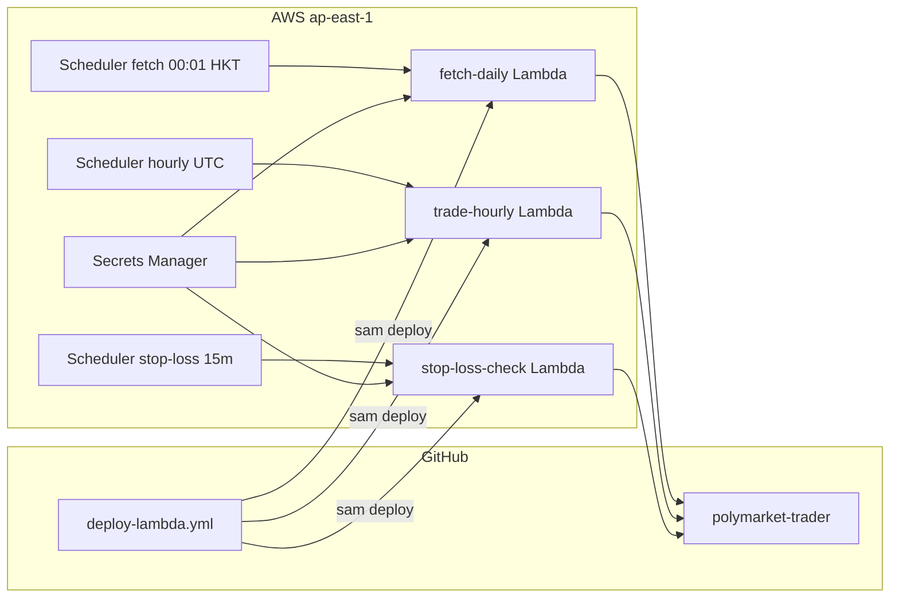

# Polymarket Weather Trading Bot

Periodic Python bot for Polymarket "highest temperature" daily weather markets.

## Features

- **Daily fetch** (`fetch-daily`): discovers today's highest-temp events via Gamma API, enriches with city timezone (API Ninjas) and local noon UTC window.
- **Hourly trade** (`trade-hourly`): trades events inside the local trading window (default **13:30–15:30**). After position checks, refreshes each event's markets from the Gamma API and CLOB buy prices before selection and order placement.
- **Stop-loss check** (`check-stop-loss`): every 15 minutes, scans live wallet positions via the Polymarket Data API; for events whose slug/title contains `highest-temperature-in-`, only evaluates positions when city local time is at or after **4:30 PM** on the event date; sells only when **`STOP_LOSS_PCT_FLOOR`% < value_pct < `STOP_LOSS_PCT`%** (where \(value\_pct = (current\_mid / avgPrice) \times 100\)); skips when an open sell order already exists.
- **Two strategies** (select via `STRATEGY` env or `--strategy`):
  - `highest_yes` — buy the market with highest live book price if below `YES_PRICE_MAX` (default 0.60).
  - `forecast_match` — fetch forecast max temp (Wunderground resolution source or Open-Meteo fallback), buy matching bucket.
- **Trade logging**: step-by-step JSON logs in `logs/trades/` and `logs/app.log`.
- **Dry-run default**: no real orders until `DRY_RUN=false` or `--live`.

## Setup

Requires **Python 3.9.10+** (3.12+ recommended). Live trading needs `py-clob-client-v2` (included in `requirements.txt`).

```bash
cd polymarket-trader
# Use Python 3.12+ if your system python is older than 3.9.10 (e.g. macOS 3.9.6)
python3.12 -m venv .venv   # or: /opt/homebrew/bin/python3.12 -m venv ../.venv
source .venv/bin/activate
pip install -r requirements.txt
cp .env.example .env
# Edit .env with API_NINJAS_KEY and wallet credentials for live trading
```

## Usage

```bash
# Fetch today's events (run once daily)
python -m src.main fetch-daily

# Fetch events for a specific date
python -m src.main fetch-daily --date 2026-06-14

# Hourly trade (dry-run by default, uses today's events file)
python -m src.main trade-hourly
python -m src.main trade-hourly --date 2026-06-14
python -m src.main trade-hourly --strategy forecast_match
python -m src.main trade-hourly --strategy highest_yes --live
python -m src.main trade-hourly --date 2026-06-19 --live

# Manual run outside the noon window (trades every city for the date)
python -m src.main trade-hourly --date 2026-06-19 --all-cities --live

# Stop-loss check (dry-run by default)
python -m src.main check-stop-loss
python -m src.main check-stop-loss --live

# Run built-in scheduler (daily fetch + hourly trade)
python -m src.main run-scheduler
```

### `trade-hourly` commands explained

| Command | Date | Strategy | Real orders? |
|---------|------|----------|--------------|
| `trade-hourly` | Today (or `EVENT_DATE` env) | `STRATEGY` env (default `highest_yes`) | No — dry-run |
| `trade-hourly --date 2026-06-14` | June 14 events file | `STRATEGY` env | No — dry-run |
| `trade-hourly --strategy forecast_match` | Today | `forecast_match` | No — dry-run |
| `trade-hourly --strategy highest_yes --live` | Today | `highest_yes` | Yes |
| `trade-hourly --date 2026-06-19 --live` | June 19 | `STRATEGY` env | Yes |
| `trade-hourly --date 2026-06-19 --all-cities --live` | June 19 | `STRATEGY` env | Yes (all cities, skip noon filter) |

`--strategy highest_yes` and omitting `--strategy` are **identical** when `STRATEGY=highest_yes` in `.env` (the default). Use `--strategy` only to override the env var.

`--live` overrides `DRY_RUN=true` in `.env` and places real Polymarket orders. Without `--live`, the bot may select markets and log `DRY RUN buy`, but no orders are sent.

### When trades run

By default, the bot trades cities inside **`TRADING_WINDOW_START_HOUR`–`TRADING_WINDOW_END_HOUR`** (default **13:30–15:30** local). Window bounds use each city's timezone and `event_date` in the events file.

- Run during a city's trading window → tradable.
- Run outside the window → `Found 0 tradable events` (expected).
- Past event dates → all windows have passed; use `--all-cities` for a manual run.
- `run-scheduler` and AWS Lambda call `trade-hourly` at **:30 UTC** each hour; the gate skips when no event is in its local window.

Cities are skipped when:
1. You have an **open buy order** on any market for that city (checked first — one API call), or
2. The selected market's live price is **≥ `YES_PRICE_MAX`** (no extra API calls), or
3. You already hold **`SHARE_COUNT`** Yes shares on any market in that city, or
4. You hold a **partial** position on a **different** market than the one selected (`partial_on_other_market`).

If you hold a **partial** position (`0 < shares < SHARE_COUNT`) on the **selected** market, the bot still trades and orders only the gap: `SHARE_COUNT - held_shares` (rounded up).

If your order is gone (filled, cancelled, or expired) and you have no position, the city can trade again. `data/positions/bought_events.json` is an audit log only.

### Prices: selection vs order

Both selection and orders use **live CLOB book** prices (after `refresh_prices`).

| Field | Role |
|-------|------|
| `selection_price` / `yes_price` | **Market selection** — highest live book price per city (`SELECTION_PRICE_SOURCE`, default `midpoint`). |
| `order_price` | **Order limit price** — `ORDER_PRICE_SOURCE` (default `midpoint`). |
| `gamma_yes_price` | Gamma `outcomePrices` (Polymarket UI %); logged only, not used for selection/orders by default. |
| `midpoint` | CLOB mid or (bid+ask)/2 — default for selection and orders. |
| `buy_price` / `best_ask` | Lowest ask on the book. |
| `best_bid` | Highest bid. |

**Default:** select by highest live `midpoint`, place limit buy at refreshed `midpoint`. `YES_PRICE_MAX` is checked before the position check and again after the final price refresh.

**Flow:** refresh all markets (Gamma + CLOB) → open-order filter → select highest `SELECTION_PRICE_SOURCE` → drop if selection price ≥ `YES_PRICE_MAX` → position check (only survivors) → refresh selected market → re-check `YES_PRICE_MAX` → place order at `ORDER_PRICE_SOURCE`.

Example: Gamma shows 60% but book midpoint is 0.43 — selection and order use **0.43**, not 0.60.

Selection snapshots in `data/selections/` include `order_price`, `order_status`, and `order_id` after the run.

## Configuration

| Variable | Default | Description |
|----------|---------|-------------|
| `API_NINJAS_KEY` | — | API Ninjas timezone lookup |
| `PRIVATE_KEY` | — | Wallet private key for CLOB |
| `DEPOSIT_WALLET_ADDRESS` | — | Polymarket proxy/funder address (from your profile) |
| `SIGNATURE_TYPE` | `1` | `0`=MetaMask EOA, `1`=email/Magic proxy, `2`=Gnosis Safe. Avoid `3` until SDK fix |
| `STRATEGY` | `highest_yes` | `highest_yes` or `forecast_match` |
| `SHARE_COUNT` | `15` | Shares per buy (min 5 on weather markets) |
| `YES_PRICE_MAX` | `0.60` | Max live selection price for highest_yes (checked after price refresh) |
| `SELECTION_PRICE_SOURCE` | `midpoint` | Rank markets by live book: `midpoint`, `buy_price`, `best_bid`, `best_ask`, `yes_price` |
| `ORDER_PRICE_SOURCE` | `midpoint` | Order limit price: `midpoint`, `buy_price`, `yes_price`, `best_bid`, `best_ask` |
| `ORDER_EXPIRY_MINUTES` | `55` | Minutes until unfilled orders expire (`GTD`). Set `ORDER_EXPIRY_HOURS=0` for no expiry (`GTC`). |
| `TRADING_WINDOW_START_HOUR` | `13:30` | Local time when trading opens: `13`, `13:30`, or `1330` (city timezone) |
| `TRADING_WINDOW_END_HOUR` | `15:30` | Local time when trading closes: `15`, `15:30`, or `1530` (city timezone) |
| `DRY_RUN` | `true` | Skip real order placement |
| `DAILY_FETCH_HOUR_UTC` | `6` | Scheduler daily fetch hour |
| `EVENT_DATE` | _(empty)_ | Default date `YYYY-MM-DD` for fetch/trade (today if empty) |
| `STOP_LOSS_DRY_RUN` | `false` | Stop-loss-only dry-run flag (independent from `DRY_RUN`) |
| `STOP_LOSS_ORDER_EXPIRY_MINUTES` | `13` | Stop-loss sell order expiry (independent from `ORDER_EXPIRY_MINUTES`) |
| `STOP_LOSS_PCT_FLOOR` | `10` | Stop-loss lower bound: only sell when value_pct is above this and below `STOP_LOSS_PCT` |
| `STOP_LOSS_MIN_LOCAL_TIME` | `16:30` | Stop-loss only runs at or after this local time on the event date (city timezone) |

## Data layout

```
data/events_*.json           # daily event cache per date
data/selections/              # markets_yes_DATE_TIME.json snapshots
data/positions/bought_events.json
logs/app.log
logs/trades/                  # per-event step logs
```

## Cron

See [`scripts/cron.example`](scripts/cron.example).

## AWS Lambda (scheduled jobs)

Fetch and trade run on **AWS Lambda in ap-east-1** (Hong Kong), avoiding Polymarket geo-blocks (Singapore is close-only). A thin GitHub Actions workflow deploys code on push to `main`.

| Job | Schedule | What it does |
|-----|----------|--------------|
| `fetch-daily` | **00:01 HKT** daily | Fetches that day's events and commits `data/events_YYYY-MM-DD.json` |
| `trade-hourly` | **:30 UTC** each hour | Fetches events JSON from GitHub, skips when no event is in its local trading window; otherwise runs trade and commits `data/selections/*.json` |
| `stop-loss-check` | **Every 15 min UTC** | Scans live positions via Data API; sells highest-temp holdings when value ≤ `STOP_LOSS_PCT`% of avg buy |



### One-time AWS setup

Full console walkthrough (steps 1–6) and region migration: **[`docs/aws-console-setup.md`](docs/aws-console-setup.md)**

| Step | What |
|------|------|
| 1 | IAM OIDC provider for GitHub |
| 2 | Deploy role trust policy |
| 3 | Deploy role permissions policy |
| 4 | GitHub variables + first deploy (GHA) |
| 5 | Secrets Manager credentials |
| 6 | Verify CloudFormation, Lambda, Scheduler |

Policy files: [`infrastructure/iam/github-deploy-trust.json`](infrastructure/iam/github-deploy-trust.json), [`infrastructure/iam/github-deploy-policy.json`](infrastructure/iam/github-deploy-policy.json).

### Manual invoke

```bash
# Fetch today's events (HKT date)
aws lambda invoke --function-name polymarket-trader-fetch-daily \
  --region ap-east-1 \
  --payload '{"date":"2026-06-27"}' out.json && cat out.json

# Trade (respects trading window gate)
aws lambda invoke --function-name polymarket-trader-trade-hourly \
  --region ap-east-1 \
  --payload '{"date":"2026-06-27"}' out.json && cat out.json

# Force trade outside window (dry-run unless DRY_RUN=false in Secrets Manager / .env)
aws lambda invoke --function-name polymarket-trader-trade-hourly \
  --region ap-east-1 \
  --payload '{"force":true,"date":"2026-06-27"}' out.json && cat out.json

# Stop-loss check (skips clone when wallet has no positions)
aws lambda invoke --function-name polymarket-trader-stop-loss-check \
  --region ap-east-1 \
  --payload '{}' out.json && cat out.json

# Optional: verify Polymarket geoblock from your machine (HK/ap-east-1 is not restricted)
python scripts/check_geoblock.py
```

### Data storage

- **Events and selections** are committed to git (`data/events_*.json`, `data/selections/*.json`) via `git add -f` from Lambda.
- **Stop-loss runs** commit `data/positions/sold_events.json` when a sell is placed.
- **Verbose step logs** go to CloudWatch Logs (`/aws/lambda/polymarket-trader-trade-hourly`, `...-stop-loss-check`).
- **`bought_events.json`** is force-committed when live trading updates it.

### Enabling live trading

Set `DRY_RUN=false` to enable live **buy** orders (default expiry `ORDER_EXPIRY_MINUTES=55`), and set `STOP_LOSS_DRY_RUN=false` to enable live **stop-loss sell** orders (default expiry `STOP_LOSS_ORDER_EXPIRY_MINUTES=13`). They are independent flags.

### Deploy troubleshooting

**`ROLLBACK_FAILED` on `sam deploy` (Creating the required resources…)**

SAM creates a bootstrap stack `aws-sam-cli-managed-default` for the S3 artifact bucket. If the deploy role lacks `s3:TagResource` or `s3:DeleteBucket`, bucket creation fails and the stack gets stuck in `ROLLBACK_FAILED`.

**Fix (in order):**

1. **Update the deploy role policy** — attach [`infrastructure/iam/github-deploy-policy.json`](infrastructure/iam/github-deploy-policy.json) to `github-polymarket-trader-deploy` (or merge the missing actions into your existing policy). Key actions that are often missing:
   - `s3:TagResource`
   - `s3:DeleteBucket`
   - `cloudformation:ListStacks`

2. **Clean up the failed bootstrap stack** (AWS Console → **ap-east-1**):
   - **S3** → find bucket `aws-sam-cli-managed-default-samclisourcebucket-*` → empty and delete it
   - **CloudFormation** → delete stack `aws-sam-cli-managed-default` (if still present)
   - If delete is blocked, use an admin/root account — the deploy role may not have had `s3:DeleteBucket` when the stack was created

3. Re-run **Deploy Lambda** workflow

If deploy fails again, check the workflow step **Diagnose CloudFormation failure** for recent stack events.

**Orphan secret:** If you manually created `polymarket-trader/credentials` before deploy, delete it or the stack may fail on duplicate names (the template now uses an auto-generated secret name).

### Code updates

Push to `main` — [`.github/workflows/deploy-lambda.yml`](.github/workflows/deploy-lambda.yml) runs `sam build` and `sam deploy` automatically when `src/`, `lambda_handlers/`, `infrastructure/`, etc. change.


## Notes

- Polymarket may block trading from geo-restricted regions.
- Weather markets typically require `orderMinSize` of 5 shares.
- `outcomePrices` are probabilities 0.0–1.0 (0.60 = 60%).
