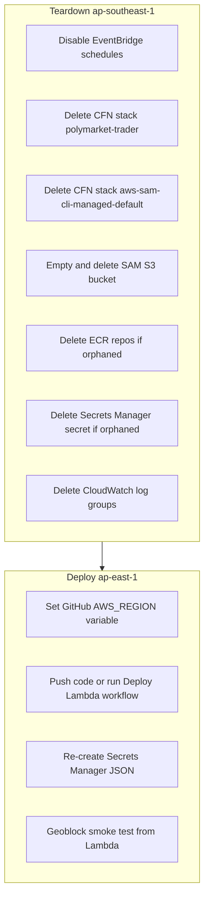

# AWS Console setup (one-time)

Region for everything below: **ap-east-1** (Hong Kong).

Replace placeholders:

| Placeholder | Your value |
|-------------|------------|
| `ACCOUNT_ID` | AWS account ID (12 digits) |
| `OWNER` | GitHub username or org |
| `REPO` | Repository name (`polymarket-trader`) |

Policy JSON files live in [`infrastructure/iam/`](../infrastructure/iam/).

---

## Polymarket geo reference

Lambda egress IP determines whether CLOB orders succeed. Per [Polymarket geoblock docs](https://docs.polymarket.com/api-reference/geoblock):

| AWS region | Maps to | Polymarket status | New orders? |
|------------|---------|-------------------|-------------|
| ap-southeast-1 (Singapore) | SG | Close-only | No |
| **ap-east-1 (Hong Kong)** | HK | Not listed | **Yes (chosen)** |
| ap-northeast-1 (Tokyo) | JP | Frontend UI restricted | Yes (API) |
| ap-northeast-2 (Seoul) | KR | Not listed | Yes |
| ap-southeast-7 (Bangkok) | TH | Close-only | No |
| ap-southeast-2/4 (Australia) | AU | Blocked | No |
| eu-west-1 (Ireland) | IE | Recommended non-georestricted | Yes |

Singapore (`ap-southeast-1`) returns `403 Trading restricted in your region` for new orders. Hong Kong shares the `Asia/Hong_Kong` timezone used by the fetch schedule.

Hong Kong (`HK`) does not appear on Polymarket's blocked or close-only country lists, so **ap-east-1 is safe for new orders**. Optional manual check from your laptop (egress IP differs from Lambda):

```bash
python scripts/check_geoblock.py
# expect: "blocked": false, "country": "HK"
```

---

## Step 1 — GitHub OIDC identity provider

1. AWS Console → **IAM** → **Identity providers** → **Add provider**
2. **Provider type:** OpenID Connect
3. **Provider URL:** `https://token.actions.githubusercontent.com`
4. Click **Get thumbprint** (auto-fills)
5. **Audience:** `sts.amazonaws.com`
6. **Add provider**

If `token.actions.githubusercontent.com` already exists, skip this step.

---

## Step 2 — Deploy IAM role (trust policy)

1. IAM → **Roles** → **Create role**
2. **Trusted entity type:** Web identity
3. **Identity provider:** `token.actions.githubusercontent.com`
4. **Audience:** `sts.amazonaws.com`
5. Skip permission policies for now → **Next**
6. **Role name:** `github-polymarket-trader-deploy`
7. Create role, then open it → **Trust relationships** → **Edit trust policy**
8. Replace the JSON with [`github-deploy-trust.json`](../infrastructure/iam/github-deploy-trust.json), substituting:
   - `ACCOUNT_ID` → your account ID
   - `OWNER/polymarket-trader` → `OWNER/REPO` (e.g. `myuser/polymarket-trader`)
9. **Update policy**

Copy the role ARN (you need it for GitHub):

```
arn:aws:iam::ACCOUNT_ID:role/github-polymarket-trader-deploy
```

---

## Step 3 — Deploy IAM role (permissions policy)

1. Open role `github-polymarket-trader-deploy` → **Permissions** → **Add permissions** → **Create inline policy**
2. **JSON** tab → paste contents of [`github-deploy-policy.json`](../infrastructure/iam/github-deploy-policy.json)
3. **Review policy** → name: `github-polymarket-trader-deploy-policy` → **Create policy**

Required actions (often missing on a minimal policy):

- `s3:TagResource` — SAM bootstrap tags the artifact bucket
- `s3:DeleteBucket` — rollback/cleanup if deploy fails
- `cloudformation:ListStacks` — SAM CLI health checks

---

## Step 4 — GitHub repository variables (before first deploy)

GitHub repo → **Settings** → **Secrets and variables** → **Actions** → **Variables**:

| Variable | Value |
|----------|-------|
| `AWS_REGION` | `ap-east-1` |
| `AWS_DEPLOY_ROLE_ARN` | `arn:aws:iam::ACCOUNT_ID:role/github-polymarket-trader-deploy` |
| `REPO_SLUG` | `OWNER/REPO` |

> Cannot use `GITHUB_` prefix — reserved by GitHub Actions.

Trigger first deploy: **Actions** → **Deploy Lambda** → **Run workflow** (or push to `main`).

SAM will create:

- Bootstrap stack `aws-sam-cli-managed-default` (S3 artifact bucket)
- Application stack `polymarket-trader` (Lambdas, Scheduler, Secrets, IAM)

### If deploy failed before (ROLLBACK_FAILED)

Clean up in the console **before** re-running deploy:

1. **S3** → bucket `aws-sam-cli-managed-default-samclisourcebucket-*` → empty → **Delete**
2. **CloudFormation** → stack `aws-sam-cli-managed-default` → **Delete**
3. Confirm Step 3 policy includes `s3:TagResource` and `s3:DeleteBucket`
4. Re-run **Deploy Lambda**

---

## Step 5 — Secrets Manager (credentials)

After stack `polymarket-trader` reaches **CREATE_COMPLETE**:

1. **CloudFormation** → stack `polymarket-trader` → **Outputs** → copy **TraderSecretArn**
2. **Secrets Manager** → open that secret → **Retrieve secret value** → **Edit**
3. Set JSON:

```json
{
  "API_NINJAS_KEY": "your-api-ninjas-key",
  "PRIVATE_KEY": "0x...",
  "DEPOSIT_WALLET_ADDRESS": "0x...",
  "GITHUB_PAT": "github_pat_...",
  "DRY_RUN": "true"
}
```

4. **Save**

| Key | Notes |
|-----|-------|
| `GITHUB_PAT` | Fine-grained PAT with **Contents: read and write** on this repo |
| `DRY_RUN` | `"true"` = no real orders; `"false"` = live trading (no redeploy needed) |

Lambda reads this secret on every invoke via `SECRETS_ARN` env var.

---

## Step 6 — Verify resources

### CloudFormation

**CloudFormation** → **Stacks** → `polymarket-trader` → status **CREATE_COMPLETE** (or **UPDATE_COMPLETE**).

Outputs:

| Output | Use |
|--------|-----|
| `FetchDailyFunctionArn` | Manual test / monitoring |
| `TradeHourlyFunctionArn` | Manual test / monitoring |
| `StopLossCheckFunctionArn` | Manual test / monitoring |
| `TraderSecretArn` | Step 5 secret |

### Lambda

**Lambda** → **Functions**:

| Function | Timeout | Schedule |
|----------|---------|----------|
| `polymarket-trader-fetch-daily` | 5 min | 00:01 HKT daily |
| `polymarket-trader-trade-hourly` | 15 min | :05 and :35 UTC each hour (events-based gate inside handler) |
| `polymarket-trader-stop-loss-check` | 15 min | Disabled by default (manual invoke only) |
| `polymarket-trader-sell-win-check` | 15 min | Enabled by default (hourly) |

Optional smoke test (AWS CLI):

```bash
aws lambda invoke \
  --function-name polymarket-trader-fetch-daily \
  --region ap-east-1 \
  --payload '{"date":"2026-06-28"}' \
  out.json && cat out.json
```

Check **Monitor** → **Logs** → CloudWatch log group `/aws/lambda/polymarket-trader-fetch-daily`.

### EventBridge Scheduler

**Amazon EventBridge** → **Schedules**:

| Schedule | Expression | Timezone |
|----------|------------|----------|
| `polymarket-trader-fetch-daily` | `cron(1 0 * * ? *)` | Asia/Hong_Kong |
| `polymarket-trader-trade-hourly` | `cron(5,35 * * * ? *)` | UTC |
| `polymarket-trader-stop-loss-check` | `cron(0/15 * * * ? *)` | UTC (disabled state) |
| `polymarket-trader-sell-win-check` | `cron(0 * * * ? *)` | UTC (enabled by default) |

Both should be **Enabled**, target = corresponding Lambda.

### Git data commit

After a successful fetch invoke, confirm a new commit on `main` with `data/events_YYYY-MM-DD.json`.

---

## Region migration (Singapore → Hong Kong)

Use this when moving from **ap-southeast-1** to **ap-east-1**. IAM OIDC provider and deploy role are **global** — no change needed.



### Step A — Update GitHub variable (before deploy)

GitHub → Settings → Variables → Actions:

| Variable | New value |
|----------|-----------|
| `AWS_REGION` | `ap-east-1` |

(`AWS_DEPLOY_ROLE_ARN` and `REPO_SLUG` stay the same.)

### Step B — Tear down old region (AWS Console, ap-southeast-1)

Switch console region to **Asia Pacific (Singapore) ap-southeast-1**:

1. **EventBridge Scheduler** → disable/delete `polymarket-trader-fetch-daily`, `polymarket-trader-trade-hourly`, and `polymarket-trader-stop-loss-check`
2. **CloudFormation** → delete stack `polymarket-trader` (wait for complete)
3. **CloudFormation** → delete stack `aws-sam-cli-managed-default`
   - If stuck: **S3** → empty bucket `aws-sam-cli-managed-default-samclisourcebucket-*` → delete → retry stack delete
4. **ECR** → delete orphaned `polymarket-trader-*` repos (if any remain after stack delete)
5. **Secrets Manager** → delete orphaned secret from old stack (if not auto-deleted)
6. **CloudWatch Logs** → delete `/aws/lambda/polymarket-trader-fetch-daily` and `...-trade-hourly` (optional cleanup)

### Step C — Deploy in ap-east-1

Switch console region to **Asia Pacific (Hong Kong) ap-east-1**:

1. Merge/push region config changes to `main`, or run **Deploy Lambda** via `workflow_dispatch`
2. SAM creates fresh bootstrap + `polymarket-trader` stack in Hong Kong
3. **Secrets Manager** (ap-east-1) → open new `TraderSecretArn` from CloudFormation outputs → paste same JSON credentials as before
4. **Verify:**
   - CloudFormation `polymarket-trader` = `CREATE_COMPLETE`
   - Both Lambdas exist
   - Schedulers enabled
   - `aws lambda invoke ... fetch-daily --region ap-east-1` commits to git
   - Trade invoke completes without `403 Trading restricted in your region` (optional: `python scripts/check_geoblock.py` from a machine in HK returns `"blocked": false`)

### Step D — If trade still returns geoblock 403

Confirm the Lambda is in **ap-east-1**, not Singapore. Alternatives: **ap-northeast-1** (Tokyo) or **eu-west-1** (Ireland). Update `AWS_REGION`, [`samconfig.toml`](../infrastructure/samconfig.toml), and redeploy. Repeat Step B teardown in the failed region first.

---

## Trading config (optional, no secret)

Non-secret settings are SAM parameters in [`infrastructure/template.yaml`](../infrastructure/template.yaml):

- `STRATEGY`, `YES_PRICE_MAX`, `TRADING_WINDOW_START_HOUR`, `TRADING_WINDOW_END_HOUR`, `ORDER_EXPIRY_MINUTES`
- `ORDER_PRICE_SOURCE`, `SELECTION_PRICE_SOURCE`, `SHARE_COUNT`, etc.

Change defaults in the template or redeploy:

```bash
cd infrastructure
sam deploy --parameter-overrides \
  "GitHubRepo=OWNER/REPO GitBranch=main Strategy=forecast_match YesPriceMax=0.55"
```

Or push to `main` — GitHub Actions runs `sam deploy` automatically.

---

## Quick reference

| Resource | Name |
|----------|------|
| Region | `ap-east-1` |
| CFN app stack | `polymarket-trader` |
| CFN bootstrap stack | `aws-sam-cli-managed-default` |
| Deploy role | `github-polymarket-trader-deploy` |
| Fetch Lambda | `polymarket-trader-fetch-daily` |
| Trade Lambda | `polymarket-trader-trade-hourly` |
| GHA workflow | `.github/workflows/deploy-lambda.yml` |
